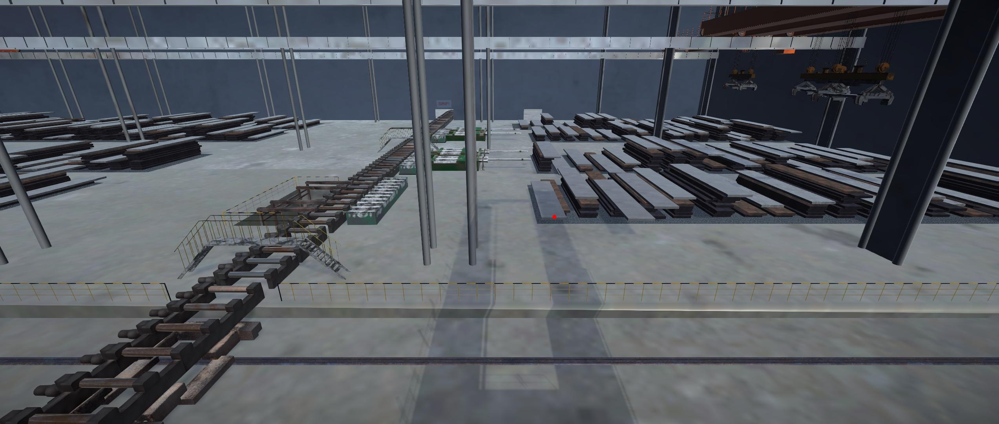
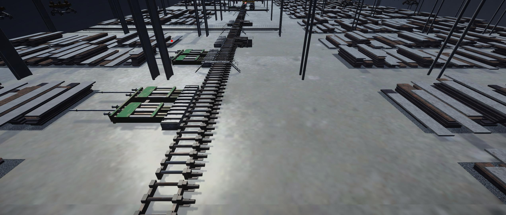

# Introduction
This code can compute epipolar line by two camera images captured from Unity 3D. It includes a coordinate system transformation from Left-hand to Right-hand since the coordinate system used in Unity 3D is Left-hand.




# Install
```python
# create environment
conda create -n epipolar_line python==3.10.14
conda activate epipolar_line

# install requirements
pip install -r requirements.txt

# run
python epipolar_line.py
```
